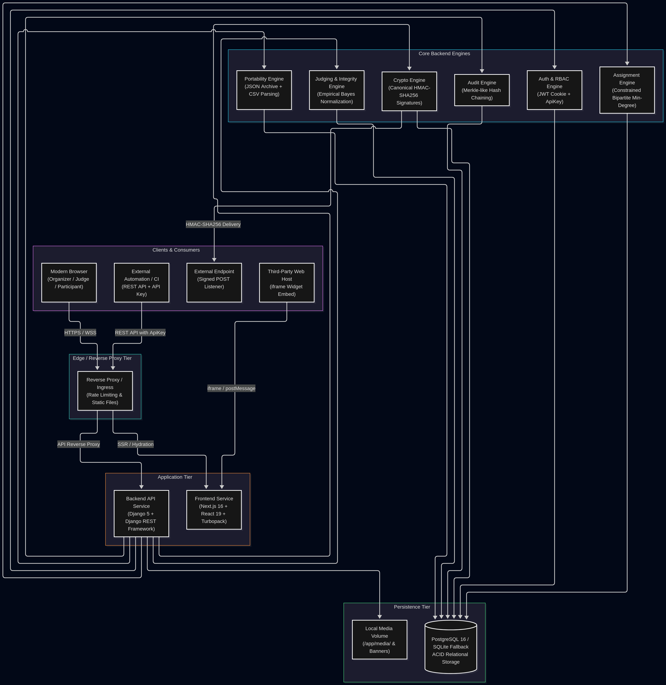
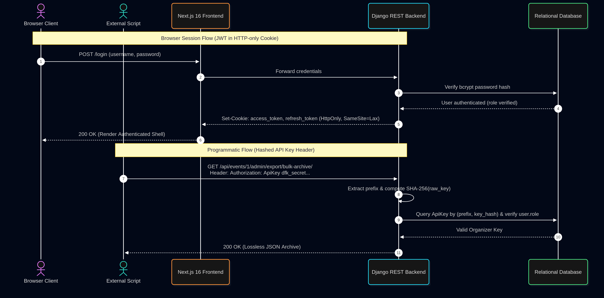
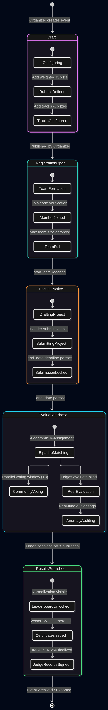
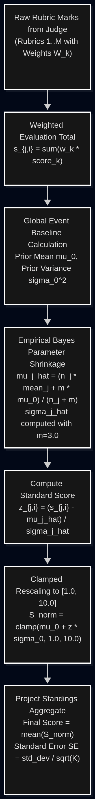
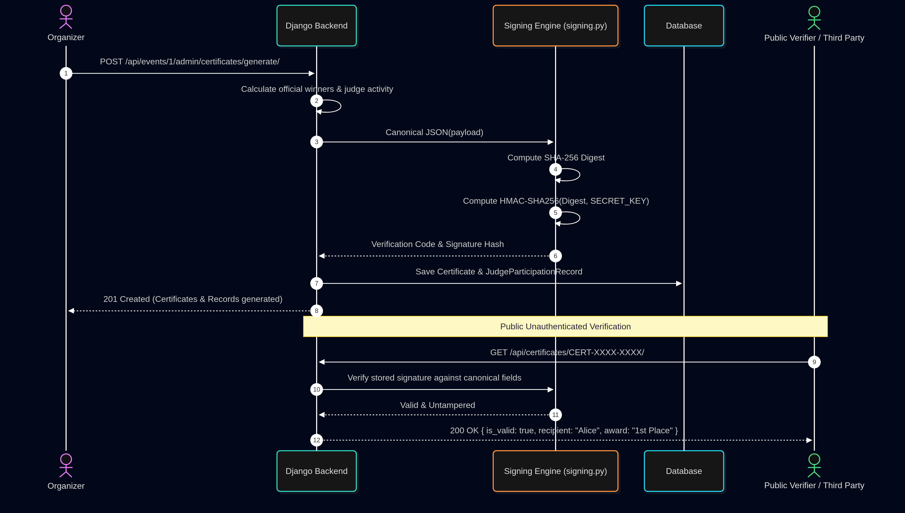
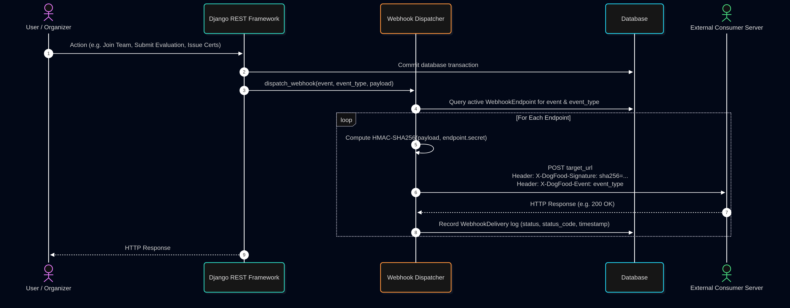

# System Architecture & Technical Specification (ARCHITECTURE.md)

**Platform:** DogFood Hackathon Platform  
**Target Standard:** Production-Grade Hackathon Infrastructure, Cryptographic Integrity, and Platform Extensibility  
**Core Principles:** Strict Role Isolation, Mathematically Defensible Evaluation, Zero Organizer Lock-In, and Immutable Auditability

---

## 1. High-Level System Architecture

DogFood is designed as a decoupled, multi-tier web application built for high concurrency, zero external runtime CDN dependencies, and verifiable integrity throughout every stage of a hackathon lifecycle.


---

## 2. Authentication, Authorization & RBAC Architecture

DogFood implements a dual authentication scheme allowing seamless, secure browser sessions alongside high-throughput scriptable API access:

1. **Browser Authentication (Cookie-Based JWT):**
   - Employs `djangorestframework-simplejwt` using encrypted, HTTP-only, `SameSite=Lax` cookies for `access` and `refresh` tokens.
   - Prevents Cross-Site Scripting (XSS) credential extraction.
   - Automatic background sliding refresh prevents session dropouts during live evaluation sessions.
2. **Programmatic API Keys (`ApiKey`):**
   - External CI/CD scripts, automated ingest pipelines, and custom bots authenticate via `Authorization: ApiKey <raw_key>`.
   - The platform generates high-entropy random keys prefixed with `dfk_` (e.g., `dfk_abc123...`).
   - Only the SHA-256 hash of the key is stored in the database. A database dump cannot compromise active API keys.
3. **Role-Based Access Control (RBAC):**
   - Four distinct user roles: `participant`, `judge`, `organizer`, and `admin`.
   - Role isolation is strictly enforced at the database and API view levels. Judges cannot modify team records; participants cannot view uncompleted scorecards or audit logs.




---

## 3. Event State Lifecycle & Governance Machine

An event advances through distinct phases, enforcing strict business rules at each transition:



---

## 4. Core Subsystem Deep Dives

### 4.1 Submission Engine & Deadline Gatekeeper
- Submissions are bound to a team via a strict one-to-one relationship (`ProjectSubmission.team`).
- Only the registered team leader (`team.leader_id == user.id`) can create or modify submissions.
- **Deadline Enforcement:** If `event.end_date` has passed, all write, update, and draft deletion attempts fail immediately with `HTTP 403 Forbidden`. The deadline is enforced strictly server-side based on timezone-aware UTC timestamps.

### 4.2 Constrained Bipartite Assignment & Anti-COI Engine
To eliminate judge fatigue and bias, the platform employs a constrained greedy min-degree bipartite matching algorithm:
- Target: Each project receives at least $K$ independent reviews (default $K=3$).
- **Conflict of Interest (COI) Filter:** A judge is strictly disqualified from receiving an assignment if:
  1. The judge is a member of the project's team.
  2. The judge was previously registered to that team.
- **Greedy Min-Degree Allocation:** Sorts projects by current review deficit ascending, selecting eligible judges with the lowest current workload to prevent variance distortion.

### 4.3 Empirical Bayes Normalization Pipeline
When evaluations are sparse, raw score averaging creates structural bias (harsh vs. lenient judges). DogFood processes all evaluations through an **Empirical Bayes Regularized Z-Score Engine**:
- Computes global prior mean $\mu_0$ and prior variance $\sigma_0^2$.
- Applies shrinkage factor ($m=3.0$) to pull individual judge distributions toward the global prior.
- Computes standardized Z-scores $z_{j,i} = \frac{s_{j,i} - \hat{\mu}_j}{\hat{\sigma}_j}$.
- Rescales normalized marks back onto a calibrated $[1.0, 10.0]$ scale and calculates the standard error of the mean ($SE_i$).




### 4.4 Merkle-Style Chained Community Vote Audit Log (T3)
To ensure community votes cannot be repudiated, altered, or injected by malicious actors or direct database tampering:
- Every voting action (`VOTE_CAST`, `VOTE_WITHDRAWN`, `VOTE_VOIDED`) appends an immutable entry to `VoteAuditLog`.
- Each entry contains an SHA-256 `entry_hash` derived from:
  $$\text{entry\_hash} = \text{SHA256}(\text{prev\_hash} \,||\, \text{timestamp} \,||\, \text{action} \,||\, \text{submission\_id} \,||\, \text{user\_id} \,||\, \text{ip\_address})$$
- The entire chain can be audited in $O(N)$ time via `/api/events/<id>/admin/community-audit/verify/`. If a single row is modified or deleted in the database, the hash chain breaks instantly at that row.

### 4.5 Digital Signatures & Public Verification Engine (T4 Stretch)
DogFood provides cryptographic proof of achievement and participation:
- **Canonical Serialization:** Formats JSON payloads deterministically (sorted keys, compact whitespace) via `backend/events/signing.py`.
- **HMAC-SHA256 Signatures:** Signs payloads with server secret keys to prevent tampering.
- **Vector SVG Generation:** Standalone SVG certificates generated server-side with embedded verification hashes, ornate guilloche vectors, and gold seals.
- **Judge Participation Records:** Appointed judges receive a signed record containing review count, rubric marks, average score given, and activity timestamps, publicly verifiable at `/verify/judge/<record_id>/`.



### 4.6 Embeddable Gallery Widget & Cross-Origin Protocol (T4 Stretch)
- **Standalone Embed Endpoint:** [`/embed/events/<id>/gallery/`](frontend/app/embed/events/[id]/gallery/page.tsx) renders a headless, responsive project gallery free from site navigation or cookie dependencies.
- **Auto-Resizing Protocol:** Utilizes window `postMessage` communication to eliminate scrollbars on the host site:
  ```typescript
  window.parent.postMessage({
    type: 'dogfood:embed:resize',
    height: Math.max(document.body.scrollHeight, document.documentElement.scrollHeight)
  }, '*');
  ```
- **Real-Time Client Filtering:** Features instant text search across titles, taglines, teams, and tech stacks, combined with dynamic track selector pills.

### 4.7 Zero-Lock-In Portability Engine (T4 Stretch)
To ensure organizers have full data sovereignty:
- **Lossless Event Export (`export_event_archive`):** Generates a comprehensive JSON archive containing all event configuration, rubrics, teams, submissions, evaluations, votes, comments, and certificates, sealed with an SHA-256 checksum.
- **Event Reconstitution (`import_event_archive`):** Recreates an entire event structure on any DogFood instance from the JSON bundle, safely remapping user accounts and resolving code collisions.
- **Bulk CSV Importer (`import_teams_csv`):** Ingests bulk team and participant lists from CSV (`team_name,username,email,is_leader`), automatically creating users and assigning leadership roles in atomic transactions.

---

## 5. Webhook Dispatch Architecture

DogFood provides real-time event dispatching covering every action reachable via the UI:



---

## 6. Directory Structure & Technology Stack

```
DogFood/
├── backend/
│   ├── config/             # Django settings, WSGI, ASGI, and root routing
│   ├── users/              # Custom User model, API keys, authentication endpoints
│   ├── events/             # Core event logic, submissions, teams, judging, webhooks
│   │   ├── models.py       # 19 relational & cryptographic models
│   │   ├── views.py        # REST viewsets & API endpoints
│   │   ├── community.py    # T3 community voting, comments & audit log verification
│   │   ├── certificates.py # T4 vector SVG generator & certificate issuance
│   │   ├── signing.py      # Deterministic canonical serialization & HMAC engine
│   │   ├── portability.py  # Bulk JSON archive & CSV ingestion engine
│   │   └── tests.py        # 98 automated unit and integration tests
│   └── manage.py
├── frontend/
│   ├── app/                # Next.js 16 App Router (Turbopack)
│   │   ├── events/         # Event exploration, management, and project submission
│   │   ├── embed/          # T4 headless embeddable gallery widget (/embed/events/[id]/gallery)
│   │   ├── certificates/   # T4 public certificate verification (/certificates/[code])
│   │   └── verify/         # T4 public judge credential verification (/verify/judge/[record_id])
│   ├── components/         # Reusable UI components, modals, and admin panels
│   └── lib/api.ts          # Typed REST API client & error handling
├── docker-compose.yml      # Orchestration for multi-container deployment
├── Dockerfile.backend      # Python 3.12+ Django image
└── Dockerfile.frontend     # Next.js standalone container image
```

---

## 7. Security Invariants & Guarantees

1. **Anti-Collusion Blindness:** Standings, raw scores, and peer evaluations remain strictly invisible to judges and participants until the organizer explicitly triggers `results_published`.
2. **Timing Attack Resilience:** All signature checks utilize `hmac.compare_digest()` to prevent side-channel timing attacks.
3. **Database Portability:** Zero raw SQL vendor locks; runs identically on PostgreSQL (production) and SQLite (local dev).
4. **Idempotent Operations:** Critical operations such as certificate generation and bulk team CSV importation are wrapped in atomic database transactions (`transaction.atomic()`).
