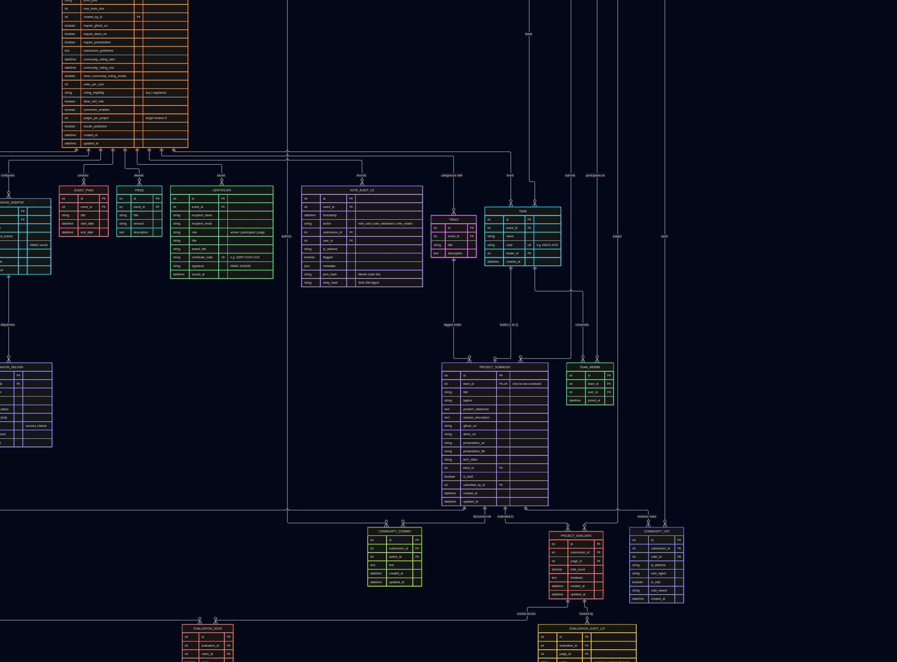
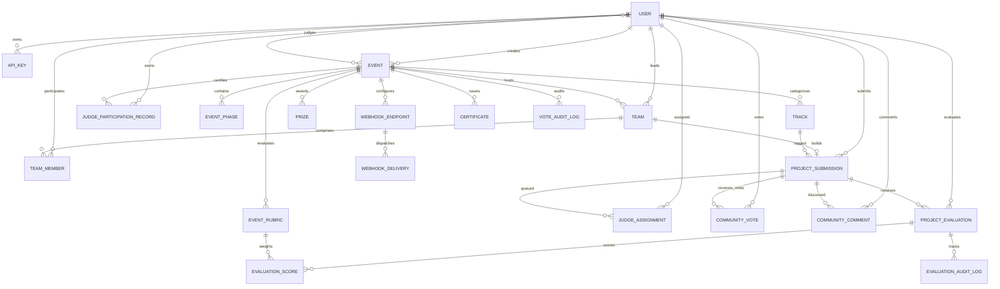
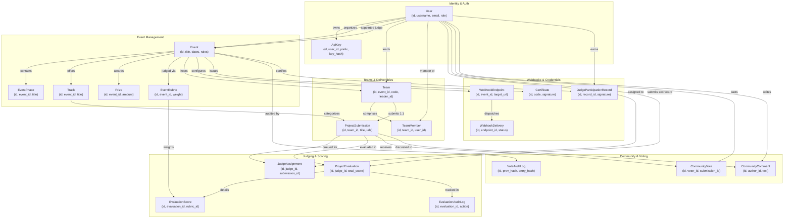

# Relational & Cryptographic Data Model Specification (DATA-MODEL.md)

**Platform:** DogFood Hackathon Platform  
**Target Standard:** 100% Relational Completeness, Cryptographic Integrity & Anti-Tamper Schema  
**Total Entities:** 21 Active Models across `users` and `events` applications

---

## 1. Complete Entity-Relationship Diagram (ERD)

The following diagrams map all 21 relational and cryptographic entities, illustrating their cardinalities and foreign key dependencies.

### Option A: Entity-Relationship Diagram (`erDiagram`)

### Option B: Universal Relational Map (`graph TD`)

*(Guaranteed compatible with all Mermaid renderers and lightweight browser viewers)*

---

## 2. Exhaustive Schema Specifications

### 2.1 Identity, Users & API Keys

#### `users_user`
Extends Django's `AbstractUser` with platform-specific fields and role-based permissions.

| Column | Type | Constraints | Description |
| :--- | :--- | :--- | :--- |
| `id` | `BigAutoField` | `PRIMARY KEY` | Unique internal user identifier. |
| `username` | `CharField(150)` | `UNIQUE, NOT NULL` | Login username. |
| `email` | `EmailField(254)` | `UNIQUE, NOT NULL` | Login email and certificate recipient address. |
| `role` | `CharField(20)` | `NOT NULL, DEFAULT 'participant'` | Enum: `participant`, `judge`, `organizer`, `admin`. |
| `bio` | `TextField` | `BLANK` | User biography or portfolio link. |
| `organization` | `CharField(150)` | `BLANK` | University, employer, or club affiliation. |
| `created_at` | `DateTimeField` | `AUTO_NOW_ADD` | Registration timestamp. |
| `updated_at` | `DateTimeField` | `AUTO_NOW` | Last profile update timestamp. |

#### `users_apikey`
Enables external automation, CI scripts, and third-party tools to authenticate programmatically.

| Column | Type | Constraints | Description |
| :--- | :--- | :--- | :--- |
| `id` | `BigAutoField` | `PRIMARY KEY` | Unique key record identifier. |
| `user_id` | `ForeignKey(users_user)` | `ON DELETE CASCADE` | The user account executing actions under this key. |
| `name` | `CharField(100)` | `NOT NULL` | Human-readable label (e.g., "GitHub Actions CI"). |
| `prefix` | `CharField(12)` | `INDEX, NOT NULL` | Non-secret key prefix (e.g., `dfk_1a2b3c4d`) for indexing. |
| `key_hash` | `CharField(64)` | `INDEX, NOT NULL` | SHA-256 hex digest of the raw secret token. |
| `is_active` | `BooleanField` | `DEFAULT TRUE` | Allows immediate key pausing without deletion. |
| `last_used_at` | `DateTimeField` | `NULLABLE` | Timestamp of most recent authenticated request. |
| `created_at` | `DateTimeField` | `AUTO_NOW_ADD` | Key generation timestamp. |

---

### 2.2 Core Event Management

#### `events_event`
The central root entity governing competition timelines, participation modes, judging rules, and community parameters.

| Column | Type | Constraints | Description |
| :--- | :--- | :--- | :--- |
| `id` | `BigAutoField` | `PRIMARY KEY` | Event ID. |
| `title` | `CharField(200)` | `NOT NULL` | Competition title. |
| `description` | `TextField` | `NOT NULL` | Event overview, themes, and rules. |
| `banner` | `ImageField` | `NULLABLE` | Promotional graphic stored at `event_banners/`. |
| `start_date` | `DateTimeField` | `NOT NULL` | Opening of the hacking window. |
| `end_date` | `DateTimeField` | `NOT NULL` | Hard deadline for project submissions. |
| `mode` | `CharField(20)` | `DEFAULT 'virtual'` | Enum: `virtual`, `in_person`, `hybrid`. |
| `location` | `CharField(255)` | `BLANK` | Physical venue or virtual Discord/URL link. |
| `prize_pool` | `CharField(100)` | `BLANK` | Cash or in-kind valuation summary. |
| `max_team_size`| `PositiveIntegerField` | `DEFAULT 4` | Maximum allowable participants per team. |
| `created_by_id`| `ForeignKey(users_user)`| `ON DELETE CASCADE` | Organizer who owns this event. |
| `require_github_url` | `BooleanField` | `DEFAULT TRUE` | Submission policy: Enforce code repository. |
| `require_demo_url` | `BooleanField` | `DEFAULT FALSE` | Submission policy: Enforce video/live URL. |
| `require_presentation`| `BooleanField` | `DEFAULT FALSE` | Submission policy: Enforce slide deck URL or PDF. |
| `community_voting_start` | `DateTimeField` | `NULLABLE` | Opening of community voting window. |
| `community_voting_end` | `DateTimeField` | `NULLABLE` | Closing of community voting window. |
| `show_community_voting_results` | `BooleanField` | `DEFAULT FALSE` | Toggles public vote visibility prior to close. |
| `votes_per_user` | `PositiveIntegerField` | `DEFAULT 3` | Cap on community votes per user (0 = unlimited). |
| `voting_eligibility` | `CharField(20)` | `DEFAULT 'any'` | Enum: `any` (any signed-in user), `registered` (teams only). |
| `allow_self_vote` | `BooleanField` | `DEFAULT FALSE` | Prevents members from voting for their own team. |
| `comments_enabled` | `BooleanField` | `DEFAULT TRUE` | Toggles public comment stream on submissions. |
| `judges_per_project` | `PositiveIntegerField` | `DEFAULT 3` | Target review saturation ($K$) for bipartite assignment. |
| `results_published` | `BooleanField` | `DEFAULT FALSE` | Locks judging; reveals official leaderboard and winners. |

#### `events_event_judges` (Many-to-Many Join Table)
- `event_id`: FK to `events_event`.
- `user_id`: FK to `users_user`.
- `UNIQUE(event_id, user_id)`: Appoints users with the `judge` role to score submissions.

---

### 2.3 Teams & Project Submissions

#### `events_team`
Represents collaborative participant groups within an event.

| Column | Type | Constraints | Description |
| :--- | :--- | :--- | :--- |
| `id` | `BigAutoField` | `PRIMARY KEY` | Team identifier. |
| `event_id` | `ForeignKey(events_event)` | `ON DELETE CASCADE` | Associated hackathon event. |
| `name` | `CharField(100)` | `NOT NULL` | Team name. |
| `code` | `CharField(20)` | `UNIQUE, NOT NULL` | Random join code (e.g. `HACK-7X9P`). |
| `leader_id` | `ForeignKey(users_user)` | `ON DELETE CASCADE` | Member authorized to submit and manage roster. |
| `created_at` | `DateTimeField` | `AUTO_NOW_ADD` | Team registration timestamp. |

#### `events_teammember`
- `team_id`: FK to `events_team` (`ON DELETE CASCADE`).
- `user_id`: FK to `users_user` (`ON DELETE CASCADE`).
- `joined_at`: `DateTimeField(auto_now_add=True)`.
- `UNIQUE(team_id, user_id)`: Prevents duplicate memberships.
- **Application Invariant:** A user can only belong to **one** team per event.

#### `events_projectsubmission`
The core deliverable submitted by a team for peer review and judging.

| Column | Type | Constraints | Description |
| :--- | :--- | :--- | :--- |
| `id` | `BigAutoField` | `PRIMARY KEY` | Project identifier. |
| `team_id` | `OneToOneField(events_team)` | `ON DELETE CASCADE` | Enforces strictly one project per team. |
| `title` | `CharField(200)` | `NOT NULL` | Project name. |
| `tagline` | `CharField(255)` | `BLANK` | Brief one-sentence elevator pitch. |
| `problem_statement` | `TextField` | `NOT NULL` | Problem background and user pain point. |
| `solution_description` | `TextField` | `NOT NULL` | Technical architecture and implementation. |
| `github_url` | `URLField` | `BLANK` | Source repository link. |
| `demo_url` | `URLField` | `BLANK` | Live deployment or Loom video link. |
| `presentation_url` | `URLField` | `BLANK` | Pitch deck URL. |
| `presentation_file`| `FileField` | `NULLABLE` | Uploaded slide deck PDF/PPTX. |
| `tech_stack` | `CharField(255)` | `BLANK` | Comma-separated tags (e.g. `React, Django, Rust`). |
| `track_id` | `ForeignKey(events_track)` | `NULLABLE, ON DELETE SET_NULL` | Competing track category. |
| `is_draft` | `BooleanField` | `DEFAULT FALSE` | When true, hidden from public gallery and judging queues. |
| `submitted_by_id` | `ForeignKey(users_user)` | `ON DELETE CASCADE` | User who authored or updated the submission. |

---

### 2.4 Judging, Rubrics & Anomaly Audit

#### `events_eventrubric`
Configurable scoring criteria with percentage weighting.

| Column | Type | Constraints | Description |
| :--- | :--- | :--- | :--- |
| `id` | `BigAutoField` | `PRIMARY KEY` | Rubric ID. |
| `event_id` | `ForeignKey(events_event)` | `ON DELETE CASCADE` | Parent event. |
| `title` | `CharField(100)` | `NOT NULL` | Criteria title (e.g., "Technical Complexity"). |
| `description` | `TextField` | `BLANK` | Guidance notes for judges. |
| `weight` | `DecimalField(5,2)` | `DEFAULT 20.00` | Percentage weight ($W_k$). |
| `max_score` | `PositiveIntegerField` | `DEFAULT 10` | Maximum raw score ceiling. |

#### `events_projectevaluation`
The master scorecard submitted by a judge for an assigned project.

| Column | Type | Constraints | Description |
| :--- | :--- | :--- | :--- |
| `id` | `BigAutoField` | `PRIMARY KEY` | Evaluation ID. |
| `submission_id` | `ForeignKey(events_projectsubmission)` | `ON DELETE CASCADE` | Scored project. |
| `judge_id` | `ForeignKey(users_user)` | `ON DELETE CASCADE` | Reviewing judge. |
| `total_score` | `DecimalField(5,2)` | `NOT NULL` | Weighted sum across all rubric items. |
| `feedback` | `TextField` | `BLANK` | Qualitative notes to the team. |
| `created_at` | `DateTimeField` | `AUTO_NOW_ADD` | Timestamp of initial submission. |
| `updated_at` | `DateTimeField` | `AUTO_NOW` | Timestamp of latest modification. |
| *Constraint* | `UNIQUE(submission_id, judge_id)` | | Prevents duplicate evaluations per judge. |

#### `events_evaluationscore`
- `evaluation_id`: FK to `events_projectevaluation` (`ON DELETE CASCADE`).
- `rubric_id`: FK to `events_eventrubric` (`ON DELETE CASCADE`).
- `score`: `DecimalField(4,2)` — raw score awarded (e.g. `8.50`).
- `UNIQUE(evaluation_id, rubric_id)`: Exactly one mark per rubric per evaluation.

#### `events_evaluationauditlog`
Maintains an immutable record of all scorecard creations, updates, and outlier detections.
- Columns: `evaluation_id`, `judge_id`, `action` (`CREATED`, `UPDATED`, `FLAGGED`), `old_scores` (JSON), `new_scores` (JSON), `reason` (text), `timestamp`.

---

### 2.5 Community Voting & Cryptographic Tamper-Proof Audit

#### `events_communityvote`
Stores peer votes cast during the open community voting window.

| Column | Type | Constraints | Description |
| :--- | :--- | :--- | :--- |
| `id` | `BigAutoField` | `PRIMARY KEY` | Vote ID. |
| `submission_id` | `ForeignKey(events_projectsubmission)` | `ON DELETE CASCADE` | Recipient project. |
| `voter_id` | `ForeignKey(users_user)` | `ON DELETE CASCADE` | Voting participant. |
| `ip_address` | `GenericIPAddressField` | `NULLABLE` | Remote client IP for sybil detection. |
| `user_agent` | `CharField(500)` | `BLANK` | Browser user-agent signature. |
| `is_void` | `BooleanField` | `DEFAULT FALSE` | Set to true when voided by an organizer. |
| `void_reason` | `CharField(255)` | `BLANK` | Audit reason explaining why the vote was voided. |
| *Constraint* | `UNIQUE(submission_id, voter_id)` | | Restricts user to 1 vote per project. |

#### `events_voteauditlog`
An immutable, append-only ledger with cryptographic hash chaining ensuring tamper detection.

| Column | Type | Constraints | Description |
| :--- | :--- | :--- | :--- |
| `id` | `BigAutoField` | `PRIMARY KEY` | Log entry ID. |
| `event_id` | `ForeignKey(events_event)` | `ON DELETE CASCADE` | Parent event context. |
| `timestamp` | `DateTimeField` | `NOT NULL` | High-precision audit timestamp. |
| `action` | `CharField(30)` | `NOT NULL` | `VOTE_CAST`, `VOTE_WITHDRAWN`, `VOTE_VOIDED`. |
| `submission_id` | `PositiveIntegerField` | `NULLABLE` | Targeted submission ID. |
| `user_id` | `PositiveIntegerField` | `NULLABLE` | Acting voter or administrator ID. |
| `ip_address` | `GenericIPAddressField` | `NULLABLE` | Client IP address. |
| `flagged` | `BooleanField` | `DEFAULT FALSE` | True if flagged by rapid-voting heuristics. |
| `metadata` | `JSONField` | `DEFAULT dict` | Contextual payload (reasons, user agents). |
| `prev_hash` | `CharField(64)` | `NOT NULL` | SHA-256 hash of the immediate preceding entry. |
| `entry_hash` | `CharField(64)` | `NOT NULL` | SHA-256 digest of this entry's canonical payload. |

---

### 2.6 Extensibility, Webhooks & Cryptographic Credentials

#### `events_webhookendpoint`
Registered HTTP listener endpoints receiving real-time action dispatches.

| Column | Type | Constraints | Description |
| :--- | :--- | :--- | :--- |
| `id` | `BigAutoField` | `PRIMARY KEY` | Endpoint ID. |
| `event_id` | `ForeignKey(events_event)` | `ON DELETE CASCADE` | Event scope. |
| `target_url` | `URLField(500)` | `NOT NULL` | External consumer HTTP POST target. |
| `subscribed_events`| `JSONField` | `DEFAULT list` | Array of subscribed event strings (or `["*"]`). |
| `secret` | `CharField(64)` | | HMAC-SHA256 key for `X-DogFood-Signature` (shown once at creation). |
| `is_active` | `BooleanField` | `DEFAULT TRUE` | Toggles webhook delivery without deletion. |

#### `events_webhookdelivery`
Execution log recording status, payload, response code, and latency for every dispatch.

| Column | Type | Constraints | Description |
| :--- | :--- | :--- | :--- |
| `id` | `BigAutoField` | `PRIMARY KEY` | Delivery ID. |
| `endpoint_id` | `ForeignKey(events_webhookendpoint)` | `ON DELETE CASCADE` | Target listener. |
| `event_type` | `CharField(60)` | `NOT NULL` | Triggering event (e.g. `team.joined`). |
| `payload` | `JSONField` | `NOT NULL` | Exact JSON body dispatched. |
| `response_status` | `IntegerField` | `NULLABLE` | HTTP response code returned by listener. |
| `response_body` | `TextField` | `BLANK` | Truncated response body from receiver. |
| `status` | `CharField(20)` | `NOT NULL` | `success` or `failure`. |
| `attempt_count` | `PositiveIntegerField` | `DEFAULT 1` | Number of delivery attempts. |

#### `events_certificate`
Cryptographically signed achievement credentials issued to winners, participants, and judges.

| Column | Type | Constraints | Description |
| :--- | :--- | :--- | :--- |
| `id` | `BigAutoField` | `PRIMARY KEY` | Certificate ID. |
| `event_id` | `ForeignKey(events_event)` | `ON DELETE CASCADE` | Issuing event. |
| `recipient_name` | `CharField(200)` | `NOT NULL` | Full name or handle of recipient. |
| `recipient_email` | `EmailField` | `NOT NULL` | Email address of recipient. |
| `role` | `CharField(20)` | `NOT NULL` | Enum: `winner`, `participant`, `judge`. |
| `title` | `CharField(255)` | `NOT NULL` | Certificate title (e.g. "Certificate of Excellence"). |
| `award_title` | `CharField(255)` | `NOT NULL` | Distinction (e.g. "1st Place Winner", "Distinguished Judge"). |
| `certificate_code`| `CharField(64)` | `UNIQUE, NOT NULL` | Public verification code (`CERT-XXXX-XXXX`). |
| `signed_payload` | `JSONField` | | Claims frozen at issuance (what the signature covers). |
| `signature` | `CharField(128)` | `NOT NULL` | Ed25519 signature (hex) over canonical `signed_payload`. |
| `revoked_at` / `revocation_reason` | `DateTimeField` / `CharField` | `NULL` | Set when a re-issuance supersedes the certificate. |
| `issued_at` | `DateTimeField` | | Timestamp of cryptographic issuance. |

#### `events_judgeparticipationrecord`
Verifiable credential attesting to an appointed judge's active evaluations and scoring telemetry.

| Column | Type | Constraints | Description |
| :--- | :--- | :--- | :--- |
| `id` | `BigAutoField` | `PRIMARY KEY` | Record row ID. |
| `record_id` | `CharField(64)` | `UNIQUE, INDEX, NOT NULL` | Publicly shareable verification UUID string. |
| `judge_id` | `ForeignKey(users_user)` | `ON DELETE CASCADE` | Appointed judge account. |
| `event_id` | `ForeignKey(events_event)` | `ON DELETE CASCADE` | Evaluated event context. |
| `evaluations_count`, `rubrics_scored_count`, `average_score_given`, `first/last_evaluation_at` | | | Scoring telemetry. |
| `signed_payload` | `JSONField` | | Claims frozen at signing time. |
| `canonical_digest` | `CharField(64)` | `NOT NULL` | SHA-256 of canonical `signed_payload`. |
| `signature` | `CharField(128)` | `NOT NULL` | Ed25519 signature (hex) over canonical `signed_payload`. |
| `issued_at` | `DateTimeField` | `AUTO_NOW_ADD` | Finalization timestamp. |
| *Constraint* | `UNIQUE(judge_id, event_id)` | | Exactly one signed credential per judge per event. |

---

## 3. Cryptographic Invariants & Validation Guarantees

1. **Deterministic Serialization:** In both `VoteAuditLog` and `JudgeParticipationRecord`, JSON dictionaries are serialized using `json.dumps(obj, sort_keys=True, separators=(',', ':'))` before hashing to ensure cross-platform cryptographic repeatability.
2. **Merkle Link Integrity:** A `VoteAuditLog` entry $i$ is mathematically unforgeable without invalidating entry $i+1$, as `entry_hash_i` is embedded as `prev_hash_{i+1}`.
3. **Key Isolation:** API Keys only store an irreversible SHA-256 digest. Neither administrators nor database operators can retrieve raw tokens from storage.
