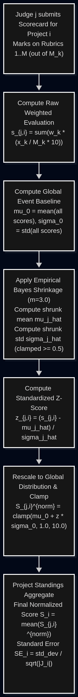
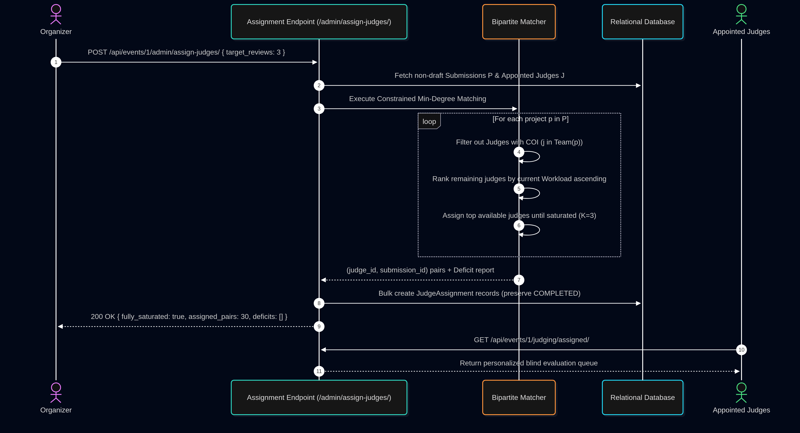
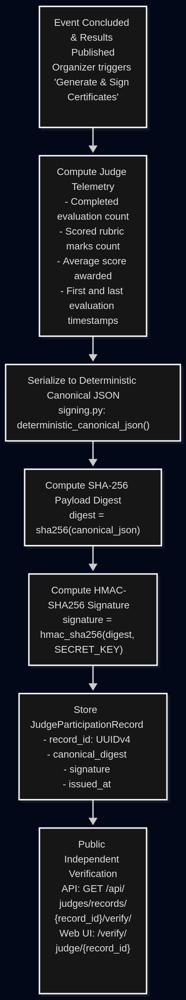

# Judging Integrity & Scoring Architecture Specification (JUDGING.md)

**Platform:** DogFood Hackathon Platform  
**Target Standard:** 25% Judging Integrity Rubric Allocation  
**Core Principles:** Mathematically Defensible Normalization, Role Isolation, Algorithmic Assignment, and Immutable Auditability

---

## 1. Executive Defense & System Philosophy

A hackathon's legitimacy hinges entirely on the integrity of its judging pipeline. In traditional hackathons, evaluation systems suffer from three catastrophic structural flaws:

1. **Statistical Distortion (Lenient vs. Harsh Judges):** Different judges have wildly divergent internal baselines. A team reviewed by a lenient judge giving 9.0s gains an unearned advantage over a superior team reviewed by a strict judge whose ceiling is 6.5.
2. **Anchoring Bias & Collusion:** Exposing public leaderboards or peer scores during an ongoing round anchors subsequent judge evaluations toward the prevailing consensus and allows colluding judges to strategically vote-dump against competitors.
3. **Unregulated Allocation & Conflicts of Interest:** Manual assignment leads to reviewer fatigue, uneven review saturation (1 review for team A vs 5 reviews for team B), and judges scoring projects submitted by their own teammates or close affiliations.

DogFood replaces ad-hoc judging with a **technically defensible judging engine** designed around:
- **Empirical Bayes Regularized Z-Score Normalization** to eliminate mean and dispersion bias.
- **Constrained Bipartite Min-Degree Assignment** ensuring uniform review saturation (`K ≥ 3`) and zero Conflict of Interest (COI).
- **Backend-Enforced Role Isolation & Blind Evaluation** preventing anchoring and tampering.
- **Event-Sourced Audit Logging & Real-Time Anomaly Detection** for forensic dispute resolution.
- **Streaming CSV Export** across all evaluation phases for public transparency.

---

## 2. Cross-Judge Score Normalization

### 2.1 The Statistical Problem

In distributed hackathon evaluation, judges evaluate sparse subsets of projects. Because every judge does not evaluate every project, raw numerical averages introduce two fatal statistical errors:

1. **Location Bias (Mean Shift μ_j):**
   - Judge A grades with mean `μ_A = 8.8`.
   - Judge B grades with mean `μ_B = 4.5`.
   - A team scoring 8.0 under Judge A is below average for that judge (`-1.0σ`), but under raw averaging beats a top-tier project evaluated by Judge B that scored 6.5 (`+2.0σ`).
2. **Dispersion Bias (Variance Shift σ_j):**
   - Judge C clusters all scores between 6.8 and 7.2 (`σ_C ≈ 0.2`).
   - Judge D spreads scores from 1.0 to 10.0 (`σ_D ≈ 2.5`).
   - Judge D exerts over **12× more variance** on final standings than Judge C, effectively silencing Judge C's voice.

### 2.2 Comparative Evaluation of Normalization Methodologies

| Method | Formulation | Strengths | Failure Modes & Critique | Decision |
| :--- | :--- | :--- | :--- | :--- |
| **Raw Arithmetic Mean** | `S̄_i = (1/K) * Σ s_{j,i}` | Trivial to explain. | Fails completely under judge heterogeneity; rewards teams lucky enough to get lenient judges. | **Rejected** |
| **Min-Max Rescaling** | `((s - min) / (max - min)) * 10` | Bounds to `[0, 10]`. | Highly sensitive to extreme single outliers. Undefined when `min = max`. | **Rejected** |
| **Olympic Trimmed Mean** | Drop min & max; average remainder | Resilient against 1 rogue judge. | Requires `K ≥ 5`. At hackathon density (`K = 3`), dropping min and max leaves 1 score. Does not normalize scale. | **Rejected for sparse graphs** |
| **Percentile / Rank Borda** | Rank projects per judge; aggregate percentiles | Invariant to monotonic calibration habits. | Destroys interval margins; a 0.01 pt lead yields the same rank jump as a 5.0 pt blowout. | **Rejected** |
| **Empirical Bayes Regularized Z-Score** | `z_{j,i} = (s_{j,i} - μ̂_j) / σ̂_j` (with Bayesian shrinkage) | Standardizes location and scale, robust to small `n`, mathematically optimal for Gaussian rubric marks. | Requires variance stabilization when `n_j < 3` or `σ_j = 0`. Solved via prior shrinkage. | **Adopted** |

### 2.3 Mathematical Derivation of DogFood's Normalization Engine

To resolve small-sample instability (`n_j < 3`) and zero-variance degeneration (`σ_j = 0`), DogFood implements **Empirical Bayes shrinkage**. The judge's observed sample mean `s̄_j` and sample variance `s_j²` are shrunk toward the event's global prior mean `μ_0` and global variance `σ_0²` using pseudo-observation weighting:

#### Step 1: Global Baseline Estimation
Given all evaluations in the event `E`:

```
μ_0 = (1 / N_total) * Σ(s_e)
σ_0 = sqrt( (1 / (N_total - 1)) * Σ(s_e - μ_0)² )
```

*(If `N_total ≤ 1` or the global variance is ~0, `σ_0` falls back to the neutral constant `1.5`.)*

#### Step 2: Empirical Bayes Shrunk Parameters
For each judge `j` who completed `n_j` evaluations, with shrinkage strength parameter `m = 3.0`:

```
μ̂_j = (n_j * s̄_j + m * μ_0) / (n_j + m)

σ̂_j² = ( (n_j - 1) * s_j² + m * σ_0² + (n_j * m / (n_j + m)) * (s̄_j - μ_0)² ) / (n_j + m - 1)

σ̂_j = max( sqrt(σ̂_j²), 0.5 )
```

#### Step 3: Standard Score & Clamped Rescaling
For raw weighted score `s_{j,i}` given by judge `j` to project `i`:

```
z_{j,i} = (s_{j,i} - μ̂_j) / σ̂_j

S_{j,i}^norm = clamp( μ_0 + z_{j,i} * σ_0, 1.0, 10.0 )
```

#### Step 4: Final Submission Aggregate & Standard Error
For project `i` evaluated by set of judges `J_i`:

```
S̄_i = (1 / |J_i|) * Σ S_{j,i}^norm

Standard Error SE_i:
  If |J_i| > 1:  sqrt( (1 / (|J_i| - 1)) * Σ(S_{j,i}^norm - S̄_i)² ) / sqrt(|J_i|)
  If |J_i| ≤ 1:  0.0
```




---

## 3. Weighted & Configurable Judging Rubrics

### 3.1 Relational Architecture
Each event defines `M` custom rubrics (`R_1, ..., R_M`), with percentage weights `W_k ≥ 0` and per-rubric maximum marks `M_k` (default 10).

```
Σ(W_k) = 100%  (for k = 1..M)
```

If an organizer configures weights totaling `W_total ≠ 100%`, the system dynamically normalizes weights:

```
w_k = W_k / Σ(W_l)  (for l = 1..M)
```

### 3.2 Evaluation Scoring Formula
When judge `j` rates project `i` on rubrics `R_k` with marks `x_{j,i,k} ∈ [1, M_k]` (each mark is first rescaled to a /10 scale):

```
Raw Total Score s_{j,i} = Σ( (10 * x_{j,i,k} / M_k) * w_k ) ∈ [1.0, 10.0]  (for k = 1..M)
```

**Backend validation:** every rubric must be scored exactly once (a partial score sheet is rejected, otherwise missing rubrics would silently count as 0), marks outside `[1, M_k]` are rejected, and rubrics become **read-only once the first evaluation exists** so weights cannot be changed mid-round.

This raw weighted score preserves the relative importance assigned to criteria (e.g. 40% Innovation vs 30% Technical Depth vs 30% Presentation) prior to cross-judge normalization.

---

## 4. Algorithmic & Batch Judge Assignment Strategy

### 4.1 Objective & Constraints
Let `P = {p_1, ..., p_N}` be submitted projects, and `J = {j_1, ..., j_M}` be appointed judges.  
Target:
1. **Target Saturation:** Each project is assigned to at least `K = 3` judges.
2. **Workload Capping:** No judge receives more than `C_max = ceil(N * K / M) + 1` projects.
3. **Strict Conflict of Interest (COI) Invariant:**
   ```
   For all (j, p): j ∉ TeamMembers(p) AND j ≠ Author(p)
   ```
4. **No Track Affinity (deliberate):** Z-score normalization (§2) assumes each judge sees a roughly random slice of the field. Routing judges to tracks would make a judge who drew a strong track look "harsh" and one who drew a weak track look "lenient", so normalization would penalize the wrong teams. We therefore keep assignment track-blind and randomized; per-track standings can still be read from the leaderboard.

### 4.2 Minimum-Degree Bipartite Allocation Algorithm

```
Algorithm: Load-Balanced COI-Free Judge Allocation
Input: Submissions P, Judges J, Saturation K=3, Slack S=1
Output: Assignment Pairs (judge_id, submission_id)

1. Compute capacity threshold: C_max = ceil(|P| * K / |J|) + S
2. Build COI graph: Edge (j, p) marked FORBIDDEN if j in Team(p)
3. Initialize Workload[j] = 0 for all j in J
4. Initialize Assigned[p] = empty set for all p in P

5. For each project p in P (sorted ascending by count of viable judges):
     While |Assigned[p]| < K:
       ViableJudges = { j in J | (j, p) not FORBIDDEN and 
                                 j not in Assigned[p] and 
                                 Workload[j] < C_max }
       If ViableJudges is empty:
         Relax the workload cap (COI is never relaxed)
         If still empty: record DEFICIT(p) and stop filling p
       
       Rank ViableJudges by:
         1. Workload[j] ascending (load balancing)
         2. Random tie-breaker (avoid deterministic bias)
       
       Select best judge j*
       Assigned[p].add(j*)
       Workload[j*] += 1

6. Return pairs (j, p) for all p in P, j in Assigned[p], plus the DEFICIT list
```

Completed reviews are never reshuffled: re-running assignment keeps `COMPLETED` pairs and only redistributes `PENDING` ones. The API response includes `fully_saturated`, `deficits` and `max_workload`, and the chosen `K` is stored on the event (`judges_per_project`) so the progress dashboard measures saturation against it.

**Known limitation:** the greedy pass processes the most-constrained projects first, which works well in practice, but it is not guaranteed to find a complete assignment in every case where one exists. A max-flow formulation would give that guarantee; when the greedy pass falls short, it reports the deficit explicitly rather than failing silently.



---

## 5. Backend-Enforced Role Isolation & Blind Judging

### 5.1 Role Isolation Matrix

| Capability | Anonymous | Participant | Judge | Organizer | Admin / Superuser |
| :--- | :---: | :---: | :---: | :---: | :---: |
| **Browse Public Gallery** | Yes | Yes | Yes | Yes | Yes |
| **Submit Evaluation** | Blocked (401) | Blocked (403) | Judges of *this* event; once assignments exist, **assigned projects only** | Blocked (403) unless also appointed judge | All projects (except COI) |
| **Evaluate Own Project (COI)** | Blocked (401) | Blocked (403) | **Strictly Blocked (403)** | Blocked (403) | Blocked (403) |
| **Evaluate Drafts / after Publish** | — | — | Blocked (400) | Blocked (400) | Blocked (400) |
| **Submissions Roster** | Blocked (401) | Blocked (403) | Own event only, drafts hidden | Own event only | All |
| **View Leaderboard Before Publish** | **Hidden (403)** | **Hidden (403)** | **Hidden (403)** | Own event only | Full Access |
| **View Leaderboard After Publish** | Yes, judges anonymized | Yes, judges anonymized | Yes, judges anonymized | Full detail (own event) | Full detail |
| **Configure Rubrics / Assign / Publish** | Blocked (401) | Blocked (403) | Blocked (403) | Own event only | Yes |
| **Export CSVs** | Blocked (401) | Blocked (403) | Blocked (403) | Own event only | Yes |
| **Join a team in the event** | — | Yes | **Blocked (403) if judging it** | — | — |

"Organizer" permissions always mean *organizer of this event* (`event.created_by`). Holding the organizer role is never enough to see or change another organizer's event. Judge emails and team join codes are only returned to that event's organizer and admins.

### 5.2 Blind Judging & Anchoring Prevention
- **Anti-Anchoring Guard:** During active judging, the leaderboard and current aggregate standings are strictly inaccessible via the API. Judges cannot see what scores other judges have submitted for any project.
- **Publication gate:** the organizer publishes results explicitly (`POST /api/events/<id>/admin/publish-results/`). Publishing also **locks scoring**, so no judge can adjust marks after seeing the standings.
- **Blind review (limitation):** judges currently see team names. Full double-blind review is not implemented, and it could not be airtight anyway because repository URLs and demos usually identify the team.
- **Feedback Anonymization:** Post-hackathon qualitative feedback presented to participants is attributed to generic tags (e.g. `Judge A`, `Judge B`) rather than usernames to protect judges from post-event harassment.

---

## 6. Auditability & Voting Abuse Prevention

### 6.1 Event-Sourced Evaluation Audit Trail
Rather than destructively overwriting previous marks, all evaluation mutations generate an immutable entry in `EvaluationAuditLog`:
- **Unique Sequence ID**
- **Foreign Keys:** `submission_id`, `judge_id`, `event_id`
- **Scores Snapshot:** Complete JSON array of raw per-rubric scores
- **Score Delta:** Difference in weighted score relative to prior submission
- **Forensic Metadata:** Client IP address and User-Agent. Session tokens are deliberately **never** stored, because an audit log readable by organizers must not contain credentials.
- **Dwell Time:** Seconds between the judge first opening the assigned project (recorded **server-side** on `JudgeAssignment.opened_at`) and submitting the score. The client never reports this number, so it cannot be faked.
- **Flags:** `LOO_OUTLIER`, `RAPID_SUBMISSION`
- **Timestamp:** High-resolution ISO-8601 UTC timestamp

### 6.2 Anomaly & Abuse Detection Heuristics
The engine executes three real-time anomaly detection heuristics:

1. **Leave-One-Out Discrepancy (Δ_LOO Consensus Outlier):**
   ```
   Δ_LOO = | s_{j,i} - (1 / (|J_i| - 1)) * Σ(s_{k,i}) |  (for k ∈ J_i \ {j})
   ```
   If `Δ_LOO ≥ 3.0` on a 10-point scale, the evaluation is automatically flagged for organizer audit.
2. **Speed-Running / Bot Heuristic:**
   If a judge's *first* evaluation of an assigned project arrives < 45 seconds after they first opened it, the record is flagged `RAPID_SUBMISSION`.
3. **Variance Flatlining:**
   If a judge completes ≥ 5 evaluations with variance `Var(S_j) < 0.05` (e.g. assigning straight 10s or 5s), the progress dashboard sets `flatline_warning` for that judge.

Community-voting abuse (duplicate votes, sock puppets, rate limits) is covered by T3. See [COMMUNITY.md](COMMUNITY.md).

---

## 7. Judge Progress Telemetry & Live Dashboards

Organizers maintain real-time oversight via `/api/events/<id>/admin/judging-progress/`:
- **Macro Telemetry:**
  - Total submissions, assigned judges, review saturation percentage.
  - Number of under-reviewed submissions (`< K` evaluations).
- **Judge Roster Telemetry:**
  - Per-judge assigned count, completed count, completion percentage.
  - Average review time per project.
  - Statistical profile (`μ_j`, `σ_j`) identifying harsh/lenient calibration.
- **Project Matrix:**
  - Saturation status: `SATISFIED` (`≥ K`), `IN_PROGRESS`, or `DEFICIT`.
  - Raw mean vs. Normalized score with Standard Error (`SE`). With a single review the SE is reported as `null` ("unknown"), not `0`, because one score says nothing about agreement.

---

## 8. Audit-Ready CSV Export Throughout Workflow

Every stage of the workflow has an organizer-only streaming CSV export (`401` anonymous, `403` for anyone who is not this event's organizer or an admin):

| Stage | Endpoint |
| :--- | :--- |
| Submission (before judging) | `/api/events/<id>/admin/export/submissions-csv/` |
| Assignment (during judging) | `/api/events/<id>/admin/export/assignments-csv/` |
| Scoring (during judging) | `/api/events/<id>/admin/export/rubric-breakdown-csv/` (alias `rubrics-csv/`), `/feedback-csv/`, `/evaluation-audit-csv/` |
| Results | `/api/events/<id>/admin/export/leaderboard-csv/` |
| Community (T3) | `/api/events/<id>/admin/export/community-votes-csv/`, `/community-audit-csv/` |

Column layouts of the three core exports:

1. **Official Leaderboard Export (`/api/events/<id>/admin/export/leaderboard-csv/`):**
   - Columns: `Rank, Submission ID, Project Title, Team Name, Track, Raw Score, Normalized Score, Standard Error, Completed Reviews, Outliers Flagged`
2. **Rubric Breakdown Export (`/api/events/<id>/admin/export/rubric-breakdown-csv/`):**
   - Columns: `Submission ID, Project Title, Team Name, Judge Identifier, Rubric Name, Weight %, Raw Score, Weighted Contribution, Evaluation Total, Timestamp`
3. **Qualitative Feedback Export (`/api/events/<id>/admin/export/feedback-csv/`):**
   - Columns: `Submission ID, Project Title, Team Name, Judge Identifier, Weighted Score, Feedback Notes, Submitted At`

---

## 9. Cryptographically Signed Judge Participation Records (T4 Stretch)

Hackathons historically offer zero verifiable proof for judges who dedicate hours evaluating projects. DogFood introduces **Signed Judge Participation Records** (`JudgeParticipationRecord`) providing tamper-evident cryptographic proof of an appointed judge's active service:

### 9.1 Data Telemetry & Canonical Serialization
When an organizer finalizes the event and triggers certificate issuance (`POST /api/events/<id>/admin/certificates/generate/`), the engine aggregates each judge's complete activity metrics:
- Number of evaluated projects (`N_eval`).
- Total rubric marks assigned (`N_rubrics`).
- Average score awarded (`s̄_j`).
- Timestamp of first review and timestamp of final review.

The telemetry dictionary is converted to a deterministic, compact canonical JSON representation:

```
Canonical JSON = deterministic_canonical_json(telemetry)
```

### 9.2 Cryptographic Signing Pipeline
1. **SHA-256 Digest:** The engine computes the SHA-256 hash of the canonical JSON string:
   ```
   canonical_digest = SHA256(Canonical JSON)
   ```
2. **HMAC-SHA256 Signature:** The digest is signed using HMAC-SHA256 with the platform's secret key:
   ```
   signature = HMAC-SHA256(canonical_digest, SECRET_KEY)
   ```
3. **Public Verification Key:** A random UUIDv4 string (`record_id`) is minted and bound to the record.



### 9.3 Public Independent Verification
Anyone can verify a judge's credential without needing an account or credentials:
- **API Endpoint:** `GET /api/judges/records/<record_id>/verify/` returns the canonical record, SHA-256 digest, HMAC signature, and a boolean `is_valid: true`.
- **Public Web Verifier:** Navigating to `/verify/judge/<record_id>/` presents the verified credential badge, evaluation statistics, and cryptographic proof card.
- **Judge Portal Access:** Appointed judges can view and copy their verified credential URL directly via the "My Signed Credential" button in the gallery interface.

---

## 10. Conclusion & Defensibility Summary

By combining **Empirical Bayes regularized Z-score normalization**, **constrained bipartite assignment**, **strict anti-COI role isolation**, **immutable audit logging**, and **signed judge participation records**, DogFood provides a mathematically defensible hackathon judging engine. The system corrects for judge severity and spread, hides standings until an explicit publish step (which locks scoring), enforces conflict-of-interest and assignment rules on the server, maintains an audit trail from first submission to final results, and issues cryptographically verifiable credentials for judges and winners alike. Every rule above is covered by the backend test suite (`events/tests.py`, `events/test_isolation.py`, `events/test_t4_stretch.py`).
