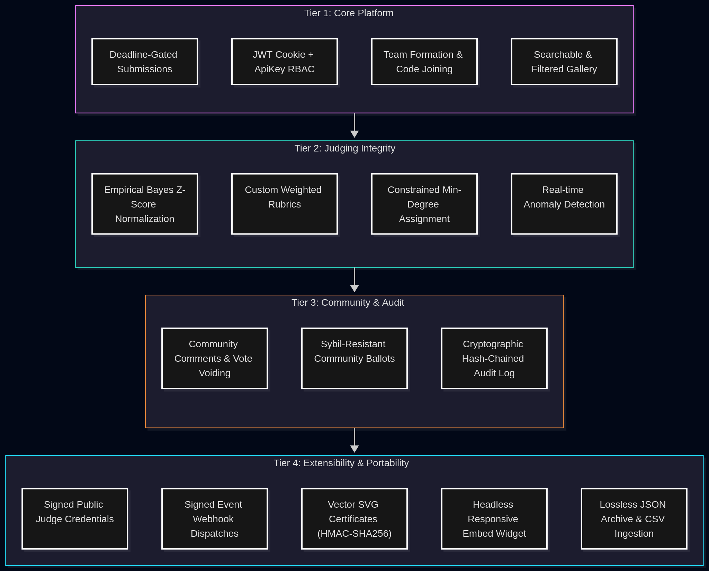

# DogFood: Production-Grade, Containerized Hackathon Platform

> **A mathematically defensible, cryptographically verified, and fully extensible hackathon platform engineered for zero organizer lock-in and absolute judging integrity.**

---

## Core Documentation Index

For in-depth technical analysis, system design, and mathematical proofs, consult our dedicated specifications:

| Specification | Description |
| :--- | :--- |
| **[ARCHITECTURE.md](ARCHITECTURE.md)** | Full system architecture, request lifecycles, auth models, and component topology. |
| **[DATA-MODEL.md](DATA-MODEL.md)** | Complete Entity-Relationship specifications across all 21 models with constraints. |
| **[JUDGING.md](JUDGING.md)** | Empirical Bayes regularized Z-score normalization, anti-COI bipartite matching, and anomaly detection. |
| **[COMMUNITY.md](COMMUNITY.md)** | Sybil-resistant community voting, rate limiting, and cryptographic hash-chained audit trails. |

---

## Platform Capabilities by Tier



### 1. Tier 1: Core Event Management & Participant Portals
- **Role-Based Access Control:** Strict role isolation across `participant`, `judge`, `organizer`, and `admin`.
- **Team Lifecycle:** Atomic creation, shareable **invite links** (`/events/<id>?join=<code>`, one click to accept; works through sign-in) plus typed join codes, automatic member cap enforcement, single-leader privileges, and conflict-of-interest blocks (judges and the organizer can't join teams in their own event).
- **Deadline Gatekeeper:** Submissions are strictly locked upon reaching `event.end_date` (evaluated server-side in UTC).
- **Public & Peer Gallery:** Real-time search by title, tech stack, and team name, with track category filtering.

### 2. Tier 2: Defensible Judging Engine (see [JUDGING.md](JUDGING.md))
- **Empirical Bayes Normalization:** Eliminates harsh/lenient judge bias and scale spread by shrinking observed judge distributions toward the global event prior ($m=3.0$).
- **Anti-Conflict-of-Interest (COI) Bipartite Matching:** Automatically assigns judges to ensure $K \ge 3$ balanced reviews while forbidding judges from scoring their own teams.
- **Anti-Anchoring Blindness:** Leaderboards and peer marks remain inaccessible until the organizer publishes results (which permanently freezes scoring).
- **Real-Time Anomaly Flags:** Detects consensus outliers ($\Delta_{\text{LOO}} \ge 3.0$), speed-running reviewers ($< 45\text{s}$ dwell time), and variance flatlining.

### 3. Tier 3: Community Voting & Tamper-Proof Audit (see [COMMUNITY.md](COMMUNITY.md))
- **Sybil Resistance:** Configurable per-user vote quotas, voter eligibility restrictions, and anti-self-voting enforcement.
- **Merkle-Style Hash Chaining:** Every vote, withdrawal, and void action appends to a cryptographically linked ledger ($H_i = \text{SHA256}(H_{i-1} \,||\, \dots)$), verifiable in $O(N)$ time.

### 4. Tier 4 & Stretch: Extensibility, Cryptography & Data Sovereignty
- **Signed REST Webhooks:** Dispatches cryptographically signed payloads (`X-DogFood-Signature: sha256=<hmac>`) for every action reachable in the UI.
- **Cryptographic Vector SVG Certificates:** 1-click issuance (after results are published) of **Ed25519-signed** certificates for Winners (ranked by the official normalized leaderboard), Participants, and Judges who scored. Publicly verifiable at `/certificates/<code\>`; re-issuing **revokes** superseded certificates instead of deleting them.
- **Signed Judge Participation Records:** Ed25519-signed credential summarizing a judge's evaluations, verifiable at `/verify/judge/<record_id\>` — or **fully offline** with the public key from `/api/signing-key/` and `scripts/verify_record.py`. No trust in the server is required.
- **Embeddable Gallery Widget:** Headless showcase at `/embed/events/<id\>/gallery/` with `postMessage` iframe auto-resizing protocol.
- **Zero Organizer Lock-In:** 1-click lossless JSON event export and import with SHA-256 integrity checksum, plus batch team CSV ingestion.

---

## Startup & Execution Options

### Option 1: Full Docker Compose (Recommended)

```bash
# First Run / After Dependency Updates (Builds images from source)
docker compose up --build

# Subsequent Runs (Instant background launch)
docker compose up -d     # Starts all containers in background
docker compose stop      # Pauses all containers
docker compose start     # Instantly resumes containers (~1 second)
docker compose down      # Stops and removes containers
```

### Option 2: Native Local Development

1. **Terminal 1: Start Django Backend**
   ```bash
   cd backend
   python3 -m venv venv && source venv/bin/activate
   pip install -r requirements.txt
   python manage.py migrate
   python manage.py createcachetable
   python manage.py runserver 8000
   ```
   *(Automatically uses SQLite if PostgreSQL is not active).*

2. **Terminal 2: Start Next.js Frontend**
   ```bash
   cd frontend
   npm run dev
   ```

### Default Credentials
On initial startup, `backend/entrypoint.sh` provisions default administrator access:
- **Username:** `admin`
- **Password:** `AdminPassword123!`
- **Role:** `admin`

---

## Comprehensive REST API Directory

### Authentication & API Keys
| Endpoint | Method | Permission | Description |
| :--- | :--- | :--- | :--- |
| `/api/auth/register/` | POST | Public | Register new account (`participant` or `organizer`). |
| `/api/auth/login/` | POST | Public | Authenticate; sets HttpOnly JWT access/refresh cookies. |
| `/api/auth/refresh/` | POST | Public | Rotates access token using refresh cookie. |
| `/api/auth/logout/` | POST | Public | Clears session cookies. |
| `/api/auth/me/` | GET | Authenticated | Profile and role context. |
| `/api/auth/users/` | GET | Admin | Lists all platform users. |
| `/api/auth/users/<id>/appoint-judge/` | POST | Admin | Appoints user as Judge. |
| `/api/auth/api-keys/` | GET / POST | Authenticated | List or mint hashed API keys (`dfk_...`). |
| `/api/auth/api-keys/<id>/` | PATCH / DELETE | Owner | Pause or permanently revoke an API key. |

### Events & Teams
| Endpoint | Method | Permission | Description |
| :--- | :--- | :--- | :--- |
| `/api/events/` | GET / POST | Public / Organizer | List events or create new competition. |
| `/api/events/<id>/` | GET / PATCH | Public / Organizer | Retrieve details or update settings. |
| `/api/events/<id>/teams/create/` | POST | Authenticated | Register team and generate unique join code. |
| `/api/events/<id>/teams/join/` | POST | Authenticated | Join team via join code. |
| `/api/events/<id>/teams/leave/` | POST | Authenticated | Leave team. |
| `/api/events/<id>/teams/lookup/?code=` | GET | Public (rate limited) | Powers invite links: team name + capacity for a code (no member details). |

### Submissions & Gallery
| Endpoint | Method | Permission | Description |
| :--- | :--- | :--- | :--- |
| `/api/events/<id>/my-submission/` | GET | Team Member | Retrieve team submission. |
| `/api/events/<id>/submit/` | POST | Team Leader | Create/update project submission before deadline. |
| `/api/events/<id>/submissions/` | GET | Organizer/Judge | Submissions roster (drafts hidden from judges). |
| `/api/events/<id>/gallery/?q=&track=` | GET | Public | Searchable non-draft gallery. |

### Judging & Integrity (T2)
| Endpoint | Method | Permission | Description |
| :--- | :--- | :--- | :--- |
| `/api/events/<id>/rubrics/` | GET / POST | Public / Organizer | Weighted rubrics configuration. |
| `/api/events/<id>/admin/assign-judges/` | POST | Organizer | Constrained bipartite assignment algorithm. |
| `/api/events/<id>/submissions/<sid>/evaluate/` | GET / POST | Assigned Judge | Dwell-clocked blind evaluation scorecard. |
| `/api/events/<id>/admin/judging-progress/` | GET | Organizer | Review saturation matrix & judge telemetry. |
| `/api/events/<id>/leaderboard/` | GET | Organizer / Public* | Empirical Bayes normalized standings (*after publish). |
| `/api/events/<id>/admin/publish-results/` | POST | Organizer | Unlocks standings; permanently locks scoring. |
| `/api/events/<id>/admin/export/<type>-csv/` | GET | Organizer | Streaming CSV exports (leaderboard, rubrics, feedback). |

### Community Voting (T3)
| Endpoint | Method | Permission | Description |
| :--- | :--- | :--- | :--- |
| `/api/events/<id>/voting/` | GET | Public | Window status, eligibility rules, and user ballot. |
| `/api/events/<id>/submissions/<sid>/vote/` | POST / DELETE | Eligible Voter | Cast or withdraw community ballot. |
| `/api/events/<id>/community-results/` | GET | Public* | Community results (*after window closes). |
| `/api/events/<id>/submissions/<sid>/comments/`| GET / POST | Public / Auth | Submit or view community feedback stream. |
| `/api/events/<id>/admin/community-audit/` | GET | Organizer | Cryptographic hash-chained audit trail. |
| `/api/events/<id>/admin/community-audit/verify/`| GET | Organizer | Validates full SHA-256 Merkle chain integrity. |

### Certificates, Judge Credentials & Portability (T4)
| Endpoint | Method | Permission | Description |
| :--- | :--- | :--- | :--- |
| `/api/events/<id>/admin/certificates/generate/` | POST | Organizer | Issues Ed25519-signed certificates & judge records (requires published results; revokes superseded ones). |
| `/api/signing-key/` | GET | Public | Ed25519 public key (hex + PEM) that verifies every certificate and judge record. |
| `/api/events/<id>/certificates/` | GET | Organizer | Lists all certificates issued for this event. |
| `/api/my-certificates/` | GET | Authenticated | Lists personal credentials awarded to caller. |
| `/api/certificates/<code>/` | GET | Public | Status (`valid` / `revoked` / `invalid`), signed claims, signature. |
| `/api/certificates/<code>/download/` | GET | Public | Direct vector SVG certificate download. |
| `/api/events/<id>/my-judge-record/` | GET | Appointed Judge| Judge's own signed participation credential. |
| `/api/judges/records/<record_id>/verify/` | GET | Public | Independent verification of judge participation. |
| `/api/events/<id>/admin/export/bulk-archive/` | GET | Organizer | Download lossless event JSON archive with SHA-256. |
| `/api/events/admin/import/bulk-archive/` | POST | Organizer | Recreate an event from a JSON archive (checksum verified; people become fresh placeholder accounts, never existing ones). |
| `/api/events/<id>/admin/import/teams-csv/` | POST | Organizer | Bulk import teams from CSV; same rules as the UI (capacity, one team per event, no judges/organizer); bad rows reported in `skipped`. |
| `/api/events/<id>/webhooks/` | GET / POST | Organizer | List or register HMAC-signed webhook endpoints (`subscribed_events: []` or `["*"]` = all). Internal/private targets are refused (SSRF guard). |
| `/api/events/<id>/webhooks/<wid>/` | PATCH / DELETE | Organizer | Update or remove an endpoint. |
| `/api/events/<id>/webhooks/<wid>/test/` | POST | Organizer | Sends an immediate signed `ping`. |
| `/api/events/<id>/webhooks/<wid>/deliveries/` | GET | Organizer | Delivery log; `.../<did>/redeliver/` retries one. |
| `/api/events/webhook-events/` | GET | Public | Every event type a webhook can subscribe to. |

---

## Automated Testing & Verification

The platform is covered by an automated test suite verifying all cryptographic operations, role isolation rules, normalization formulas, and data portability:

```bash
# Execute entire backend test suite (98 tests)
cd backend
python manage.py test

# Execute frontend TypeScript and production build checks
cd ../frontend
npm run typecheck
npm run build
```

## Configuration notes (T4)
- `SIGNING_PRIVATE_KEY` — base64 of a 32-byte Ed25519 seed. If unset, a key is derived from `SECRET_KEY` (stable across restarts; rotating `SECRET_KEY` rotates it). Set it explicitly in production.
- `WEBHOOK_ALLOW_PRIVATE_TARGETS=True` — only for local development, to let webhooks reach a receiver on your own machine/LAN. Off by default: webhooks may only call public addresses, re-checked at send time, and redirects are never followed.
- Verify any certificate or judge record yourself: `python scripts/verify_record.py http://localhost:8000/api/certificates/<code>/`

